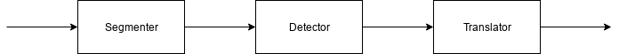

## Hieroglyphics translator

* Objective : create a mobile application that can translate hieroglyphics in real time.
* State : just an idea.

Note : the project is supervised by Dr. Yousra Alkabani - American University in Cairo - Egypt

---

### System block diagram

* Segmenter : responsible for segmenting a text into a set of hieroglyphics symbols.
* Detector : responsible for detecting each symbol.
* Translator : responsible for giving meaningful translation of the detected symbols.

---
### Used tools:
* OpenCV
* Python 3.6

---

### Notes:
* Check samples folder for input samples
* Python is used for the sake of prototyping, but C++ or Java will be used in production